<picture>
  <source media="(prefers-color-scheme: dark)" srcset="assets/profile-dark.svg">
  <source media="(prefers-color-scheme: light)" srcset="assets/profile-light.svg">
  
</picture>

### 🧠 Linguagens

### 🤖 Inteligência Artificial

### 🔐 Cybersecurity / Hacking

 

